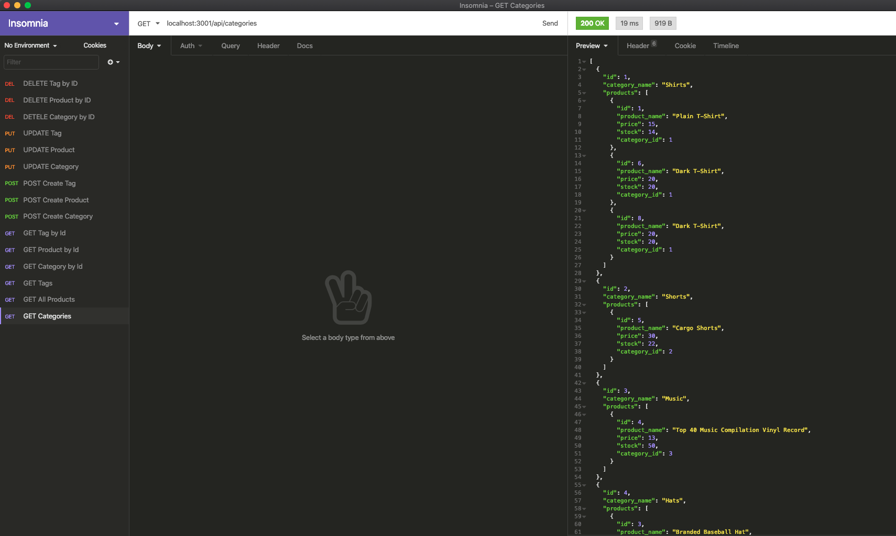
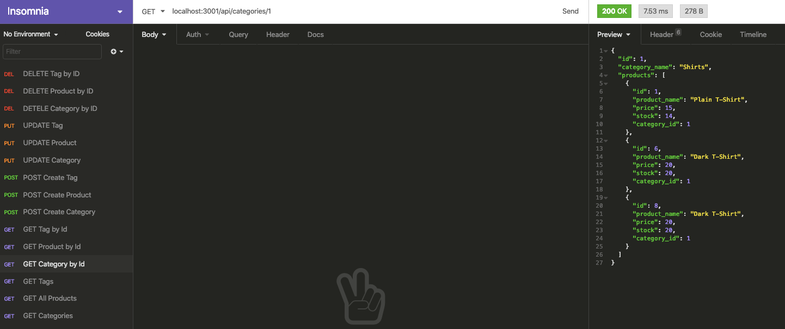
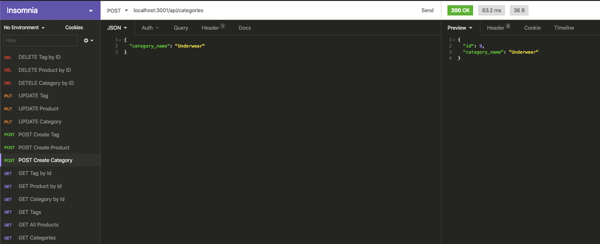
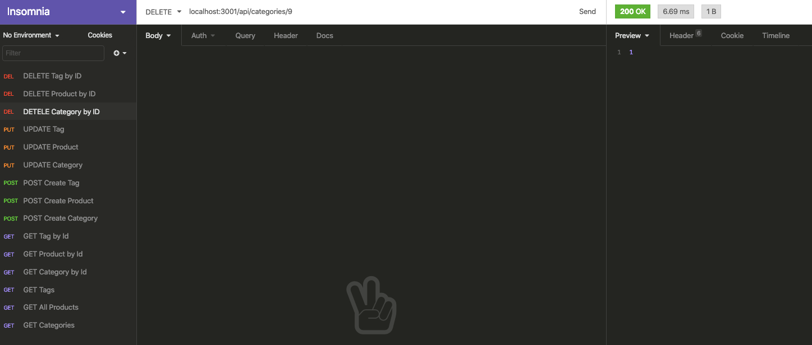

# E-Commerce Back End

Follow this link that displays the project setup, models and route files [E-Commerce Walk Through Walkthrough Video Part 1](https://drive.google.com/file/d/1jrbYe2N5neNje0E06WLDgqrqm7dQE-wH/view)

Follow this link that demonstrates the GET, POST, PUT, DELETE routes for categories, products and tags being tested in Insomnia! [E-Commerce Walk Through Walkthrough Video Part 2](https://drive.google.com/file/d/1myYyi9d4AhmWkxHbj4d954B8Ebe6bm7G/view)

  ## Table of Contents
  
  * [Description](#description)
  * [Screenshots](#screenshots)
  * [Usage](#usage)
  * [Questions](#questions)

## Description

This week we built the back end for an e-commerce site using a working Express.js API and configured it to use Sequelize to interact with a MySQL database. 

This is very useful for a manager at an internet retail company that watns a back end for their e-commerce website that uses the latest technologies. It will allow the company to compete with other e-commerce companies.

## Screenshots
Below are screenshots testing the routes in Insomnia to get all categories, get a category by id, create a category, update a category, and delete a category. Even though only category images are shown, you can also do this with the products and tags.

GET Categories 

GET Category by Id

POST (Create) Category

PUT(Update) Category

DELETE Category

## Usage
Launch terminal, run command npm start, then test routes in Insomnia.

## Questions
If you have any questions, you can reach me by emailing [melissa.daska@gmail.com](mailto:melissa.daska@gmail.com) or follow the link to my gitHub profile [melissadaska](https://github.com/melissadaska).
